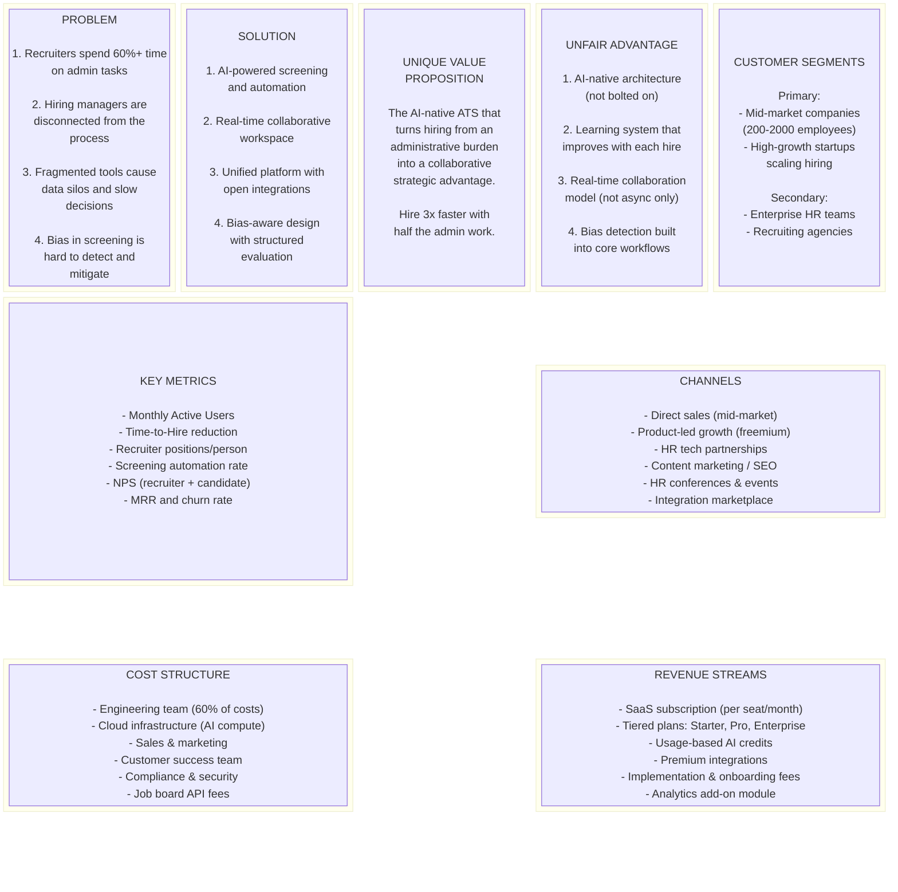
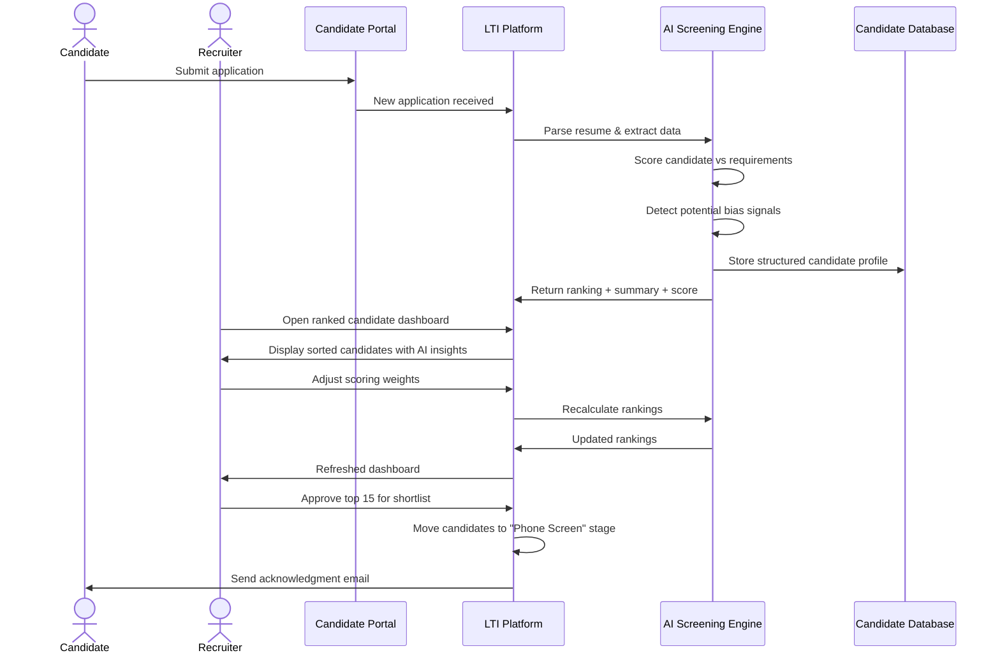
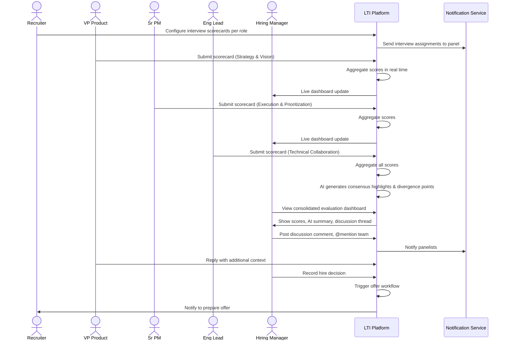
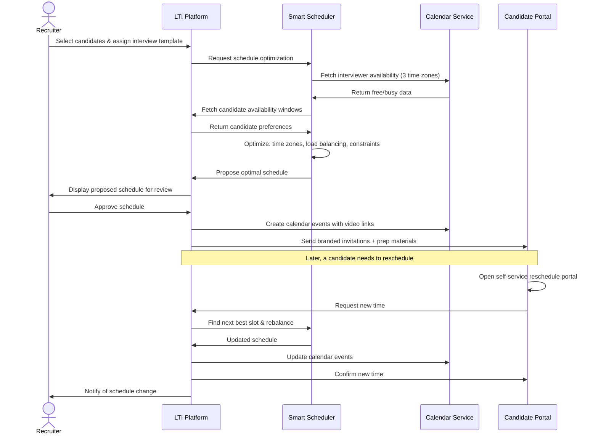
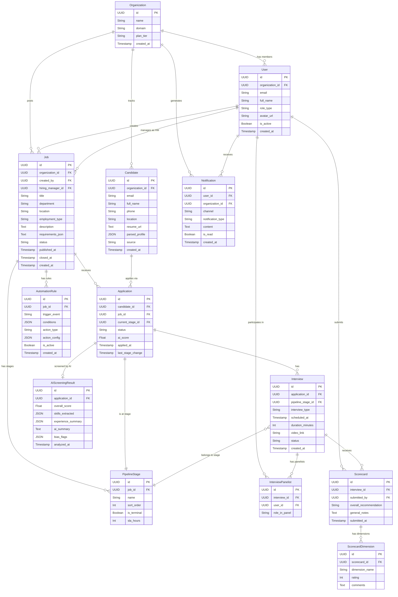
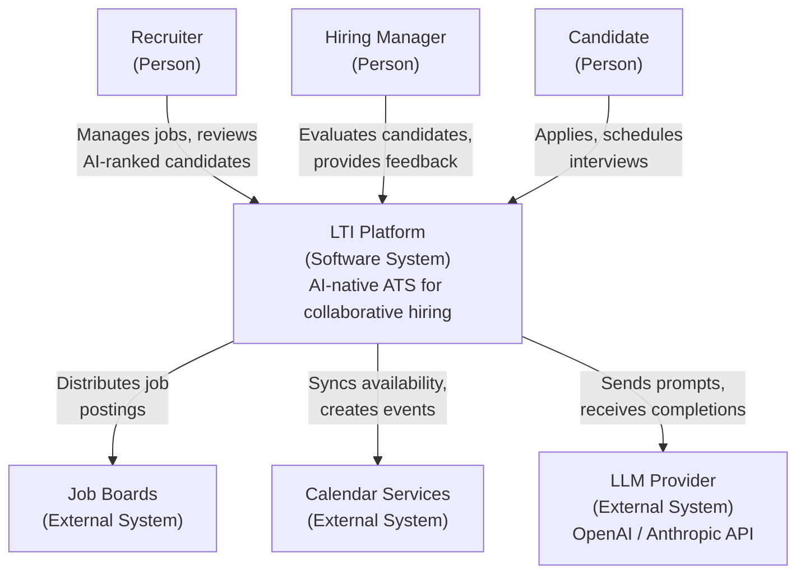
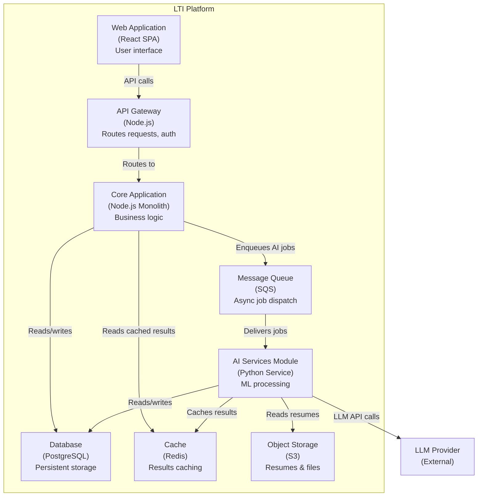
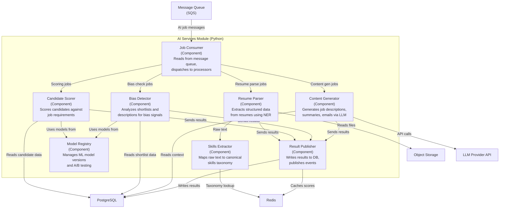
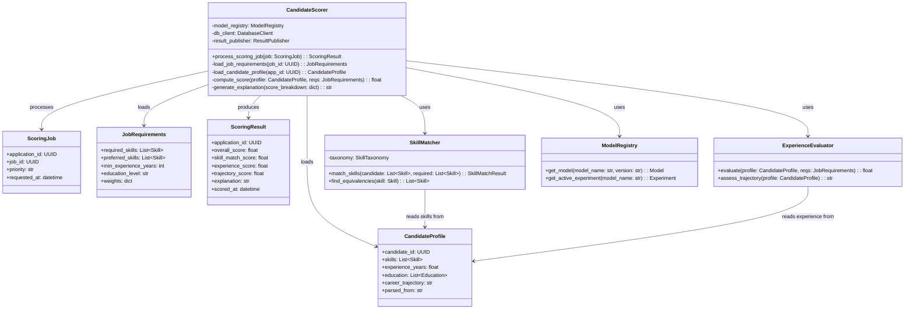

# LTI — The ATS of the Future

## 1. Product Description

### 1.1 What is LTI?

LTI (Leading Talent Intelligence) is a next-generation Applicant Tracking System designed to fundamentally transform how organizations attract, evaluate, and hire talent. Unlike traditional ATS platforms that serve primarily as digital filing cabinets for resumes, LTI is built as an **intelligent recruitment orchestration platform** that places AI-powered assistance and real-time collaboration at the core of every hiring workflow.

LTI was conceived from a simple observation: despite the proliferation of HR technology, recruiters still spend over 60% of their time on administrative tasks — parsing resumes, scheduling interviews, chasing feedback from hiring managers, and manually moving candidates through pipelines. Hiring managers, on the other hand, feel disconnected from the process until they're suddenly asked to evaluate a batch of candidates with little context. The result is slow time-to-hire, poor candidate experiences, and suboptimal hiring decisions.

LTI solves this by treating recruitment as a **collaborative, data-driven workflow** rather than a sequential administrative process.

### 1.2 Added Value

LTI delivers value across three dimensions:

**For Recruiters:** LTI automates the repetitive burden of sourcing, screening, and coordination. AI-powered resume parsing, intelligent candidate ranking, and automated scheduling free recruiters to focus on relationship building and strategic talent acquisition. A recruiter using LTI can manage 3× more open positions without sacrificing quality.

**For Hiring Managers:** Real-time collaboration tools bring hiring managers into the process at the right moments with the right context. Structured evaluation frameworks, shared scorecards, and AI-generated candidate summaries mean managers can provide meaningful feedback in minutes rather than hours, directly within the tools they already use.

**For Candidates:** A transparent, responsive hiring process powered by automated status updates, self-service scheduling, and faster decision cycles. Candidates experience a modern, respectful process that reflects well on the employer brand.

### 1.3 Competitive Advantages

The ATS market includes established players (Greenhouse, Lever, Workday Recruiting, iCIMS) and newer entrants. LTI differentiates through:

1. **AI-Native Architecture:** While competitors bolt AI features onto legacy systems, LTI is built AI-first. Every workflow — from job description generation to offer letter drafting — has an AI copilot. The system learns from each organization's hiring patterns to improve recommendations over time.

2. **Real-Time Collaborative Hiring:** Most ATS platforms treat collaboration as an afterthought (email notifications and comment threads). LTI provides a shared workspace model where recruiters, hiring managers, and interviewers co-own the hiring process with live dashboards, @mentions, instant feedback loops, and real-time pipeline visibility.

3. **Intelligent Automation Engine:** LTI's automation goes beyond simple if-then rules. The system can autonomously handle candidate pipeline progression, interview scheduling across time zones, follow-up communications, and even preliminary screening conversations via AI chat, while keeping humans in the loop for decisions that matter.

4. **Open Integration Ecosystem:** A robust API-first design with native integrations for HRIS, calendars, video conferencing, messaging platforms (Slack, Teams), and job boards. LTI fits into existing tech stacks rather than demanding wholesale adoption.

5. **Bias-Aware Design:** Built-in bias detection in job descriptions, blind screening modes, and structured evaluation frameworks that promote equitable hiring practices — increasingly a regulatory requirement, not just a nice-to-have.

---

## 2. Main Functions

### 2.1 Intelligent Job Management

Create and manage job postings with AI assistance. The system can generate job descriptions from minimal input, suggest optimal job board distribution based on role type and historical performance, and automatically format postings for different platforms. Each job has a configurable pipeline with customizable stages, automated triggers, and SLA tracking.

### 2.2 AI-Powered Candidate Screening & Ranking

When applications arrive, LTI's AI engine parses resumes, extracts structured data, and scores candidates against role requirements. The system goes beyond keyword matching — it understands skills equivalencies, career trajectories, and contextual relevance. Recruiters see a ranked candidate list with explanations for each score, enabling faster and more confident shortlisting.

### 2.3 Real-Time Collaborative Evaluation

A shared workspace where all stakeholders participate in candidate evaluation. Structured interview scorecards with predefined competencies ensure consistent assessment. Hiring managers and interviewers submit feedback via intuitive forms, and results aggregate into a consolidated candidate profile in real time. Discussion threads, @mentions, and live pipeline views keep everyone aligned.

### 2.4 Smart Scheduling & Coordination

Automated interview scheduling that syncs with participants' calendars, handles time zone complexity, proposes optimal slots, and sends branded calendar invitations. The system manages multi-round interview loops, panel interviews, and on-site visit logistics. Candidates can self-select available times via a branded portal.

### 2.5 Workflow Automation Engine

A visual automation builder where HR teams design custom workflows without code. Examples include: auto-advance candidates who pass a screening threshold, trigger assessment invitations after initial review, send rejection emails after configurable delays, escalate overdue evaluations to managers, and archive inactive candidates. The engine supports conditional logic, time-based triggers, and integration actions.

### 2.6 Analytics & Hiring Intelligence

Dashboards and reports covering pipeline health, time-to-hire, source effectiveness, interviewer calibration, diversity metrics, and bottleneck identification. AI-generated insights surface trends and recommendations — for example, flagging that a role's requirements may be too narrow based on application volume, or that a particular interview stage is causing disproportionate candidate drop-off.

---

## 3. Lean Canvas

---

## 4. Main Use Cases

### 4.1 Use Case 1: AI-Assisted Candidate Screening and Shortlisting

**Scenario:** A recruiter at a mid-market tech company has published a Senior Backend Engineer position. Within two weeks, 280 applications have arrived. The recruiter needs to identify the top 15 candidates for phone screening.

**User Pain Point:** Manually reviewing 280 resumes takes 15-20 hours and introduces fatigue-driven inconsistency. Keyword-based filtering misses strong candidates with non-standard backgrounds. The recruiter also lacks confidence that the shortlist is truly the best available.

**How LTI Solves It:** When applications flow in, LTI's AI engine automatically parses each resume, extracts structured data (skills, experience, education, projects), and scores candidates against the job requirements. The AI considers skills equivalencies (e.g., Go experience as relevant for a Rust role), career trajectory patterns, and contextual signals. The recruiter sees a ranked dashboard with each candidate's score, strengths, gaps, and an AI-generated one-paragraph summary. The recruiter can adjust weighting criteria, apply filters, and approve or override AI recommendations. Bias detection flags if the shortlist skews disproportionately on any protected dimension.

**Expected Outcome:** Resume review time drops from 15-20 hours to under 2 hours. The shortlist quality improves because the AI catches strong non-obvious candidates. The recruiter can process the pipeline for this role while simultaneously managing 5-6 other open positions.

---

### 4.2 Use Case 2: Real-Time Collaborative Candidate Evaluation

**Scenario:** A product team is hiring a Product Manager. After phone screens, 5 candidates are advancing to on-site interviews. The interview panel includes the VP of Product, two senior PMs, an engineering lead, and a designer. Each conducts a different interview (case study, behavioral, technical collaboration, culture). After interviews, the team needs to reach a hire/no-hire decision within 48 hours.

**User Pain Point:** In traditional workflows, interviewers submit feedback via email or disparate forms over several days. The hiring manager must manually aggregate feedback, chase late submissions, reconcile conflicting opinions, and schedule a debrief meeting. The process is slow, feedback is unstructured, and recency bias distorts the debrief discussion.

**How LTI Solves It:** Before interviews begin, the recruiter configures structured scorecards per interview type (competency dimensions, rating scale, must-have vs. nice-to-have signals). Immediately after each interview, panelists submit scorecards through LTI's mobile-friendly interface — guided by the structure to provide consistent, comparable feedback. Scores aggregate in real time on a shared evaluation dashboard. The hiring manager sees consolidated results as they come in, with AI-generated highlights (areas of consensus, points of divergence, red flags). An in-platform discussion thread allows async debate. When the team is ready, they can make a decision directly in the platform, triggering the next workflow step.

**Expected Outcome:** Feedback collection time drops from 3-5 days to under 24 hours. Decision quality improves through structured evaluation and reduced recency bias. The entire team feels ownership of the hiring decision.

---

### 4.3 Use Case 3: Automated Interview Scheduling

**Scenario:** A recruiter is coordinating technical interviews for 8 candidates across two rounds. Round 1 is a 60-minute technical screen with one of three available engineers. Round 2 is a 90-minute system design panel with two engineers plus the engineering manager. Participants are spread across three time zones (PST, EST, CET).

**User Pain Point:** Manual scheduling requires juggling multiple calendars, time zone conversions, candidate availability windows, interviewer load balancing, and room bookings. A single reschedule cascades into hours of rework. Recruiters report that scheduling is their single largest time sink — often consuming 30%+ of their week.

**How LTI Solves It:** The recruiter selects the 8 candidates and assigns them to the interview round template. LTI reads interviewer calendar availability via Google/Outlook integration, cross-references candidate-provided availability windows, balances load across interviewers (no one gets 6 interviews while a colleague gets 1), respects time zone business hours, and proposes optimal slot assignments. The recruiter reviews and approves the schedule in one click. Candidates receive branded calendar invitations with video links, preparation materials, and a self-service reschedule option. If a candidate reschedules, the system automatically finds the next best slot and re-balances.

**Expected Outcome:** Scheduling 8 candidates across 2 rounds drops from 4-6 hours of back-and-forth to under 15 minutes. Rescheduling is self-service and automatic. Interviewer workload is evenly distributed.

---

## 5. Data Model

The following data model captures the core entities, their attributes, and relationships required to support LTI's main functionality.

### 5.1 Entity Descriptions

**User** — Any person who interacts with the LTI platform (recruiters, hiring managers, interviewers, admins). Authentication, role assignment, and team membership originate here.

**Organization** — The company or entity that subscribes to LTI. All data is tenant-scoped to an organization.

**Job** — An open position being recruited for. Contains the role definition, requirements, pipeline configuration, and posting settings.

**Candidate** — A person who has applied or been sourced for one or more jobs. Stores personal information, resume data, and AI-extracted structured profile data.

**Application** — The junction between a Candidate and a Job. Tracks the candidate's progression through the hiring pipeline for a specific role.

**PipelineStage** — A configurable step in the hiring process for a job (e.g., "Applied", "Phone Screen", "On-Site", "Offer").

**Interview** — A scheduled interview event linking one or more interviewers with a candidate for a specific application.

**Scorecard** — Structured evaluation submitted by an interviewer after an interview. Contains dimension-level ratings and comments.

**ScorecardDimension** — A single competency or evaluation criterion within a scorecard (e.g., "Technical Depth", "Communication").

**AutomationRule** — A configurable workflow rule that triggers actions based on events or conditions within the pipeline.

**Notification** — A system-generated message delivered to users via in-app, email, or Slack/Teams.

**AIScreeningResult** — The AI engine's analysis of a candidate's application, including parsed data, score, and summary.

### 5.2 Entity-Relationship Diagram

---

## 6. High-Level System Design

### 6.1 Architecture Overview

LTI follows a **modular monolith** architecture for its initial version, designed to evolve into microservices as the product scales. This approach gives the startup the development velocity of a monolith with clear module boundaries that enable future decomposition.

The system is organized into the following layers:

**Client Layer:** A React-based Single Page Application (SPA) served via CDN, plus a mobile-responsive web interface. The client communicates with the backend exclusively through a REST API gateway, with WebSocket connections for real-time features.

**API Gateway:** A single entry point that handles authentication (JWT-based), rate limiting, request routing, and API versioning. It forwards requests to the appropriate backend modules.

**Core Application Modules:** The backend is structured as a modular monolith in Node.js/TypeScript with clearly separated domains:

- **Job Management Module** — CRUD for jobs, pipeline configuration, job board distribution.
- **Candidate Management Module** — Candidate profiles, applications, pipeline progression.
- **Collaboration Module** — Scorecards, evaluation dashboards, discussion threads, @mentions.
- **Scheduling Module** — Calendar integration, availability matching, schedule optimization.
- **Automation Engine** — Rule evaluation, trigger processing, action execution.
- **AI Services Module** — Resume parsing, candidate scoring, bias detection, content generation. This module delegates heavy computation to an external AI/ML service layer.
- **Notification Module** — Multi-channel delivery (in-app, email, Slack/Teams webhooks).
- **Analytics Module** — Metric aggregation, dashboard data, report generation.

**Data Layer:** PostgreSQL as the primary relational database (multi-tenant with row-level security). Redis for caching, session management, and real-time pub/sub. S3-compatible object storage for resumes and attachments.

**AI/ML Service Layer:** A separate Python-based service running the ML models for resume parsing (NER), candidate scoring, bias detection, and content generation. It communicates with the core backend via an internal API and message queue. This separation allows independent scaling of compute-intensive AI workloads.

**External Integrations:** Job boards (Indeed, LinkedIn), calendar services (Google Calendar, Outlook), video platforms (Zoom, Google Meet), messaging (Slack, Teams), and HRIS systems. Managed through an integration adapter layer.

**Infrastructure:** Hosted on AWS with containerized deployment (ECS/Fargate), managed database (RDS), object storage (S3), CDN (CloudFront), and a message queue (SQS) for async processing.

### 6.2 System Architecture Diagram

```mermaid
graph TB
    subgraph Clients["Client Layer"]
        WebApp["Web Application<br/>(React SPA)"]
        MobileWeb["Mobile Web<br/>(Responsive PWA)"]
    end

    subgraph CDN["Content Delivery"]
        CF["CloudFront CDN"]
    end

    subgraph Gateway["API Gateway Layer"]
        APIGW["API Gateway<br/>(Auth, Rate Limiting,<br/>Routing)"]
        WS["WebSocket Server<br/>(Real-time events)"]
    end

    subgraph Core["Core Application (Modular Monolith — Node.js/TypeScript)"]
        JobMod["Job Management<br/>Module"]
        CandMod["Candidate Management<br/>Module"]
        CollabMod["Collaboration<br/>Module"]
        SchedMod["Scheduling<br/>Module"]
        AutoMod["Automation<br/>Engine"]
        NotifMod["Notification<br/>Module"]
        AnalyticsMod["Analytics<br/>Module"]
        AIMod["AI Services<br/>Module"]
    end

    subgraph AIML["AI/ML Service Layer (Python)"]
        ResumeParser["Resume Parser<br/>(NER)"]
        Scorer["Candidate Scorer"]
        BiasDetect["Bias Detector"]
        ContentGen["Content Generator<br/>(LLM Integration)"]
    end

    subgraph Data["Data Layer"]
        PG["PostgreSQL<br/>(Primary DB,<br/>Multi-tenant RLS)"]
        Redis["Redis<br/>(Cache, Pub/Sub,<br/>Sessions)"]
        S3["S3<br/>(Resumes,<br/>Attachments)"]
    end

    subgraph Queue["Async Processing"]
        SQS["Message Queue<br/>(SQS)"]
        Workers["Background Workers"]
    end

    subgraph External["External Integrations"]
        JobBoards["Job Boards<br/>(Indeed, LinkedIn)"]
        Calendar["Calendar APIs<br/>(Google, Outlook)"]
        Video["Video Platforms<br/>(Zoom, Meet)"]
        Messaging["Messaging<br/>(Slack, Teams)"]
        HRIS["HRIS Systems"]
    end

    WebApp --> CF
    MobileWeb --> CF
    CF --> APIGW
    CF --> WS

    APIGW --> Core
    WS --> Redis

    AIMod --> SQS
    SQS --> AIML
    AutoMod --> SQS
    SQS --> Workers

    NotifMod --> Messaging
    SchedMod --> Calendar
    SchedMod --> Video
    JobMod --> JobBoards
    CandMod --> HRIS

    Core --> PG
    Core --> Redis
    Core --> S3
    AIML --> PG
    Workers --> PG
```

---

## 7. C4 Diagram: AI Services Module (Deep Dive)

The AI Services Module is the most architecturally distinctive component of LTI and the primary source of competitive differentiation. This section explores it in depth using the C4 model.

### 7.1 Level 1 — System Context

### 7.2 Level 2 — Container Diagram (AI Services Focus)

### 7.3 Level 3 — Component Diagram (Inside AI Services Module)

### 7.4 Level 4 — Code-Level View (Candidate Scorer Component)

This final level zooms into the Candidate Scorer to show its internal class structure and processing flow.

---

## 8. Conclusion

This document establishes the foundational product design for LTI — an AI-native ATS built to transform hiring from an administrative burden into a collaborative strategic advantage. The key architectural decisions (modular monolith, separate AI service layer, event-driven automation) balance startup velocity with the ability to scale. The data model supports multi-tenant operations with the flexibility to evolve as new features emerge. The three core use cases — AI screening, collaborative evaluation, and smart scheduling — represent the highest-impact workflows where LTI can immediately demonstrate value over incumbent solutions.

The recommended next step is to build an MVP focused on Use Case 1 (AI-Assisted Screening) as it delivers the most tangible efficiency gain and provides the data foundation that Use Cases 2 and 3 build upon.
